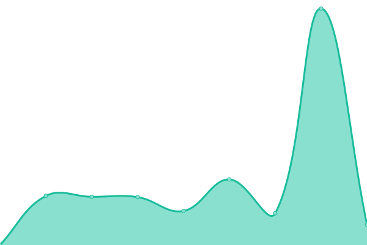

# [📈 Live Status](https://status.thalatta-thalatta.com): <!--live status--> **🟧 Partial outage**

This repository contains the open-source uptime monitor and status page for [repo](https://status.thalatta-thalatta.com), powered by [Upptime](https://github.com/upptime/upptime).

With [Upptime](https://upptime.js.org), you can get your own unlimited and free uptime monitor and status page, powered entirely by a GitHub repository. We use [Issues](https://github.com/repo/thalatta/issues) as incident reports, [Actions](https://github.com/repo/thalatta/actions) as uptime monitors, and [Pages](https://status.thalatta-thalatta.com) for the status page.

<!--start: status pages-->
<!-- This summary is generated by Upptime (https://github.com/upptime/upptime) -->
<!-- Do not edit this manually, your changes will be overwritten -->
<!-- prettier-ignore -->
| URL | Status | History | Response Time | Uptime |
| --- | ------ | ------- | ------------- | ------ |
|  [thalatta-Thalatta.com](https://thalatta-thalatta.com) | 🟩 Up | [thalatta-thalatta-com.yml](https://github.com/AvgGeo/thalatta/commits/HEAD/history/thalatta-thalatta-com.yml) | 

 1985ms
     
 | 

<a href="https://status.thalatta-thalatta.com/history/thalatta-thalatta-com">100.00%</a>
    

|  [thalatta.art](https://thalatta.art) | 🟩 Up | [thalatta-art.yml](https://github.com/AvgGeo/thalatta/commits/HEAD/history/thalatta-art.yml) | 

 9862ms
     
 | 

<a href="https://status.thalatta-thalatta.com/history/thalatta-art">100.00%</a>
    

|  [peridot-homes.com](https://peridot-homes.com) | 🟩 Up | [peridot-homes-com.yml](https://github.com/AvgGeo/thalatta/commits/HEAD/history/peridot-homes-com.yml) | 

 992ms
     
 | 

<a href="https://status.thalatta-thalatta.com/history/peridot-homes-com">100.00%</a>
    

|  [peridot-homes.gr](http://peridot-homes.gr) | 🟥 Down | [peridot-homes-gr.yml](https://github.com/AvgGeo/thalatta/commits/HEAD/history/peridot-homes-gr.yml) | 

 0ms
     
 | 

<a href="https://status.thalatta-thalatta.com/history/peridot-homes-gr">100.00%</a>
    

|  [peridot.homes](http://peridot.homes) | 🟩 Up | [peridot-homes.yml](https://github.com/AvgGeo/thalatta/commits/HEAD/history/peridot-homes.yml) | 

 1207ms
     
 | 

<a href="https://status.thalatta-thalatta.com/history/peridot-homes">100.00%</a>
    

|  [staging.peridot-homes.com](https://staging.peridot-homes.com) | 🟥 Down | [staging-peridot-homes-com.yml](https://github.com/AvgGeo/thalatta/commits/HEAD/history/staging-peridot-homes-com.yml) | 

 0ms
     
 | 

<a href="https://status.thalatta-thalatta.com/history/staging-peridot-homes-com">100.00%</a>
    

|  [IPv4 test](31.220.75.11) | 🟩 Up | [i-pv4-test.yml](https://github.com/AvgGeo/thalatta/commits/HEAD/history/i-pv4-test.yml) | 

 114ms
     
 | 

<a href="https://status.thalatta-thalatta.com/history/i-pv4-test">100.00%</a>
    

<!--end: status pages-->

[**Visit our status website →**](https://status.thalatta-thalatta.com)

## 📄 License

- Powered by: [Upptime](https://github.com/upptime/upptime)
- Code: [MIT](./LICENSE) © [Anand Chowdhary](https://anandchowdhary.com), supported by [Pabio](https://pabio.com)
- Data in the `./history` directory: [Open Database License](https://opendatacommons.org/licenses/odbl/1-0/)
